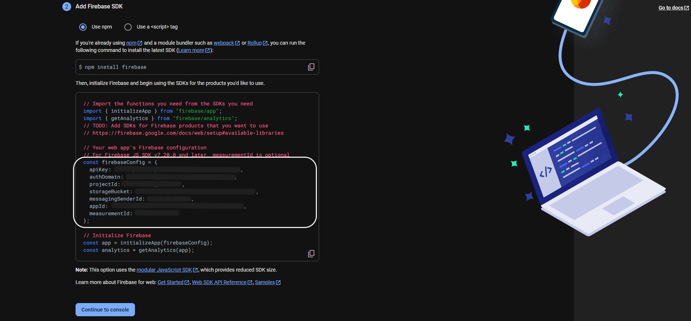
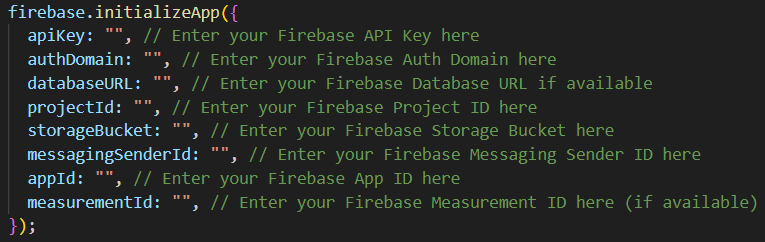
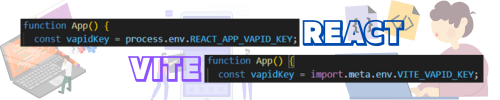
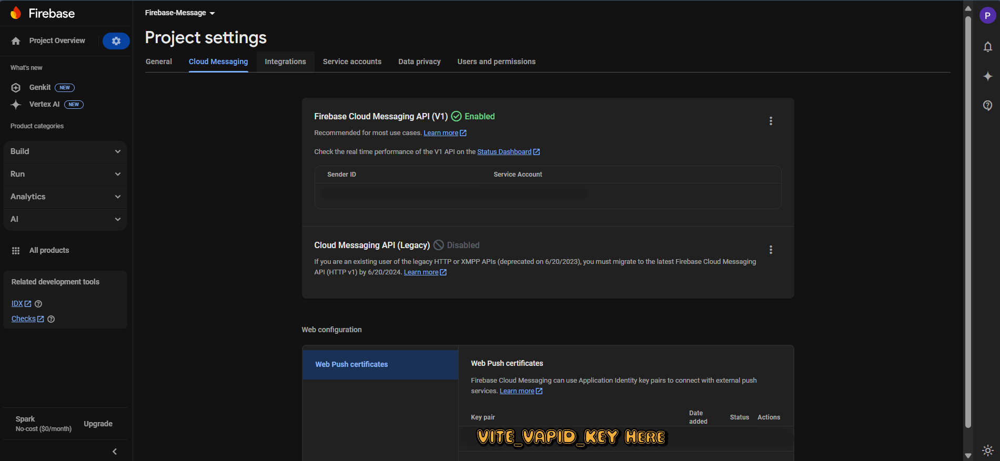
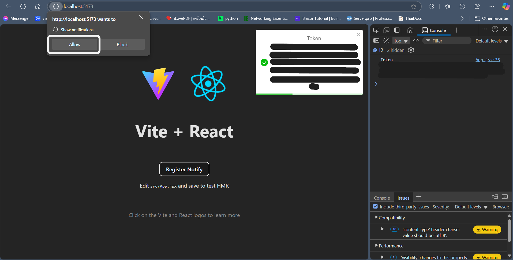
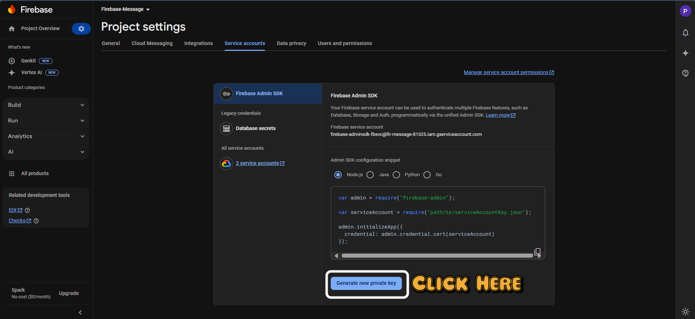
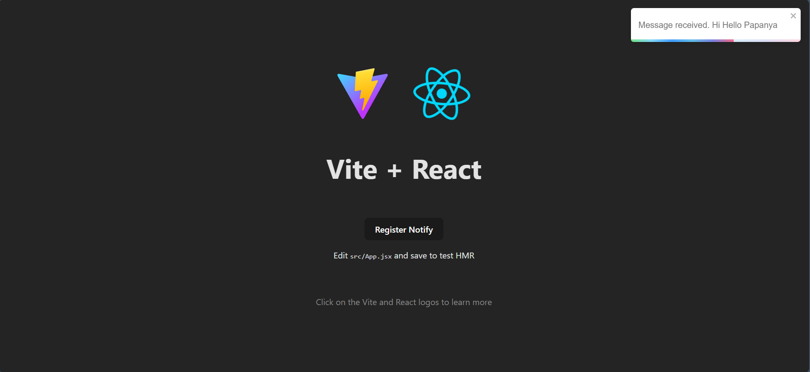
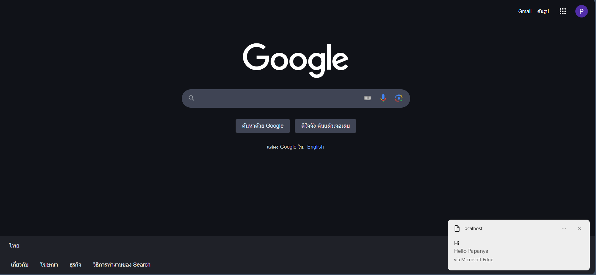

# Firebase Cloud Message Practice

## 🌟Initial Project

### 🚀 Frontend Vite + React

1. Initial Script Navigate to the `frontend` folder:

   ```bash
   cd frontend
   npm i
   ```
2. Run the development server:
   ```bash
   npm run dev
### Backend 🛠️ Node.js Express

1. Initial Script Navigate to the `backend` folder:
   ```bash
   cd backend
   npm i
   ```
2. Run the development server:
   ```bash
   npm run dev
   ```
## 🌟Initial Firebase Cloud Message
- สร้าง Project ใน Firebase  🆕 [Firebase Create Project](https://console.firebase.google.com/)
- คลิก ***🖱️Add App*** และเลือก ***🖱️Web App***.
  
- See the Official Docs at 📖 [Firebase Cloud Messaging Documentation](https://firebase.google.com/docs/cloud-messaging/js/client)

### Frontend

- สร้าง Credential file ใน`frontend/config` ใช้ template จาก `credential.example.js` จะsaveเป็นไฟล์ชื่อ `credential.js` และนำconfig จาก firebaseConfigมาใส่
  
- สร้างไฟล์ `public/firebase-messaging-sw.js` โดยใช้ template จาก `public/firebase-messaging-sw.example.js` และนำส่วนที่เป็น credential นำข้อมูลจาก firebaseConfig มาใส่ด้วย
   <div align="center">
     
   </div>
- สร้างไฟล์ `.env` โดยใช้templateจาก `.env.example`
(เมื่อใช้ Vite การ importข้อมูลจาก.envต้องใช้คำสั่ง `import.meta.env.VITE_[name]` แทน `process.env.REACT_APP_[name]` ปกติใช้ใน React)
   <div align="center">
     
   </div>
- นำ public key จาก Cloud Messaging และทำการ Generate key pair ขึ้นมาเพื่อใช้สำหรับ identify และนำไปใส่ในไฟล์.env
  ![(image/image-5.png)
  <div align="center">
     
   </div>
- การทำงานหลักอยู่ที่ `App.jsx` และ `public/firebase-messaging-sw.js`
- เมื่อผู้ใช้อนุญาตการแจ้งเตือน Firebase Notify จะทำงานได้ทั้ง Foreground และBackground โดยForeground ทำงานใน `App.jsx` และ Background ทำงานใน service worker `public/firebase-messaging-sw.js`
  

### Backend
- ใน firebase console ไปที่ Project settings > Service accounts และ Download service account file
  
- Save file ลง folder `backend` และตั้งชื่อ file ว่า `serviceAccount.json`
- For Document visit📖 [Firebase Cloud Messaging Documentation Send-Message](https://firebase.google.com/docs/cloud-messaging/send-message)

## 🧪✅ Test Program
1. หลังจาก Setting ทุกอย่างพร้อมทำการ run frontend
   ```bash
   cd frontend
   npm run dev
   ```
2. คลิกปุ่ม Register Notify และรอรับ Token
3. สร้าง post request และส่งไปยัง http://localhost:3001/api/test ตามด้วยJSON Style Body
   ```json
   {
       "token":"[TOKEN_FROM_FRONTEND]",
       "message":"Hiiii"
   }
   ```
 - *สามารถใช้postmane,apidog or another client ในการส่งrequest*
4. Result Foreground
   
- Result Background
   
