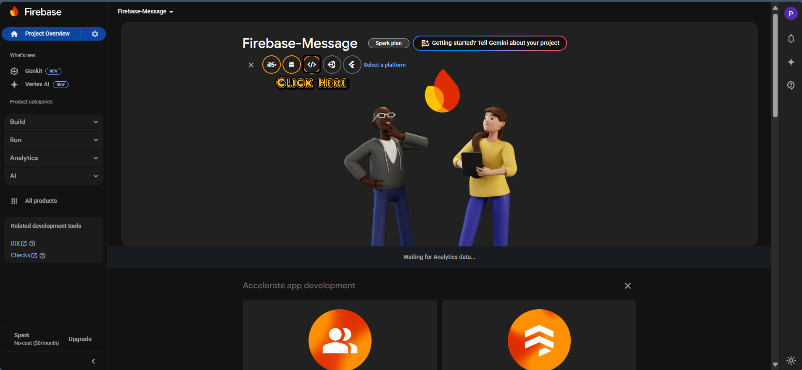

# Firebase Cloud Message Practice

## 🌟Initial Project

### 🚀 Frontend Vite + React

1. Initial Script Navigate to the `frontend` folder:

   ```bash
   cd frontend
   npm i
   ```
2. Run the development server:
   ```bash
   npm run dev
### Backend 🛠️ Node.js Express

1. Initial Script Navigate to the `backend` folder:
   ```bash
   cd backend
   npm i
   ```
2. Run the development server:
   ```bash
   npm run dev
   ```
## 🌟Initial Firebase Cloud Message
- สร้าง Project ใน Firebase  🆕 [Firebase Create Project](https://console.firebase.google.com/)
- คลิก ***🖱️Add App*** และเลือก ***🖱️Web App***.
  
- See the Official Docs at 📖 [Firebase Cloud Messaging Documentation](https://firebase.google.com/docs/cloud-messaging/js/client)

### Frontend

- Create the Credential file in `frontend/config` from `credential.example.js` to `credential.js` and put the config from your firebase console in it.
- Create file `public/firebase-messaging-sw.js` from `public/firebase-messaging-sw.example.js`
- Create file `.env` from `.env.example` (When you import with vite use `import.meta.env.VITE_` in create-react-app use `process.env.REACT_APP_`)
- Get the Vapid Key from your public key and keep in .env file
  
  
- On Frontend Focus on Recieve a message
- Main Logic is on `App.jsx` and `public/firebase-messaging-sw.js`

- Firebase Notify is both on Foreground and Backgroud for the foregroud in App.jsx backgroud is in service worker

### Backend

- In firebase console, go to setting > Service account
  and download your service account file
  
- Save file to backend and named the file `serviceAccount.json`
- For Document visit https://firebase.google.com/docs/cloud-messaging/send-message
